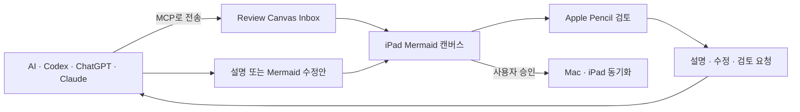

# Review Canvas

AI가 만든 Mermaid 다이어그램을 Mac에서 열고, 앞으로 iPad와 Apple Pencil로 검토할 수 있도록 확장하는 오픈 개발 프로젝트입니다.

현재 저장소에는 인터넷 없이 동작하는 네이티브 macOS Mermaid 뷰어 프로토타입이 들어 있습니다. 다음 단계에서는 iPad 검토 레이어, 기기 동기화, MCP 기반 AI 연결을 추가합니다.

> 현재 상태: 초기 프로토타입. 아직 App Store 배포 버전이 아닙니다.

## 제품 흐름



## 검토 기호

| 기호 | 의미 | AI 동작 |
| --- | --- | --- |
| `?` | 설명 필요 | 선택한 노드와 연결 관계를 설명합니다. |
| `✎` | 수정 필요 | Mermaid 변경안을 만들고 전후 차이를 보여줍니다. |
| `!` | 검토 필요 | 코드와 문서 근거를 찾아 구조를 검증합니다. |
| `✓` | 해결됨 | 사용자가 검토를 완료한 상태입니다. |

## 현재 구현

- `.mmd`, `.mermaid` 파일 열기
- Markdown의 첫 번째 Mermaid 코드 블록 추출
- Finder 드래그 앤 드롭
- 확대, 축소, 100% 복원
- 파일 다시 불러오기
- Mermaid 11.16.0 로컬 렌더링
- 밝은 화면과 다크 모드

## 로드맵

- [x] macOS Mermaid 뷰어 프로토타입
- [ ] macOS·iPadOS 공용 Xcode 프로젝트
- [ ] PencilKit 필기 오버레이
- [ ] 노드와 연결선에 고정되는 `ReviewMark`
- [ ] Mac·iPad 검토 목록 동기화
- [ ] 로컬 MCP `send_diagram`
- [ ] AI 설명과 Mermaid 수정안 왕복
- [ ] 원격 MCP, 기기 페어링, 알림
- [ ] App Store 배포

## macOS 프로토타입 빌드

요구 사항은 macOS 14 이상, Xcode Command Line Tools, Node.js입니다.

```bash
npm install
chmod +x scripts/build-app.sh
./scripts/build-app.sh
```

완성된 앱은 `dist/Review Canvas.app`에 생성됩니다. 앱에는 Mermaid 런타임이 포함되며 실행 중 외부 CDN에 접속하지 않습니다.

## 저장소 정책

- 토큰, API 키, 개인 다이어그램은 커밋하지 않습니다.
- AI가 기존 Mermaid 문서를 자동으로 덮어쓰지 않습니다.
- 수정안은 새 revision으로 만들고 사용자가 승인합니다.
- 공개 저장소이지만 라이선스는 아직 정하지 않았습니다.
