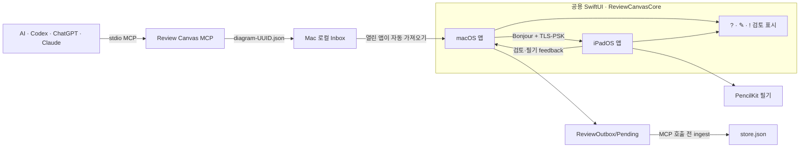

# Review Canvas

AI가 만든 Mermaid 다이어그램을 Mac에서 받아 같은 네트워크의 iPad로 즉시 보내고, Apple Pencil 검토 결과를 다시 AI에게 돌려주는 네이티브 앱입니다.

현재 저장소에는 macOS와 iPadOS가 함께 쓰는 SwiftUI 앱, Network.framework 기반 암호화 동기화, PencilKit 필기 레이어, 로컬 stdio MCP 서버와 앱→MCP 검토 bridge가 구현되어 있습니다. 아직 App Store 배포 버전은 아닙니다.

## 지금 가능한 흐름



`send_diagram`으로 보낸 다이어그램은 같은 Mac의 로컬 Inbox에 대기합니다. 열린 macOS 앱이 약 1초 안에 자동으로 가져오며, 연결된 iPad에는 이벤트 기반 연결로 바로 전달합니다. iPad에서 만든 검토 표시와 필기는 400ms 동안 묶어 Mac으로 반환합니다. 앱이 만든 검토 표시는 다음 `list_review_marks`, `propose_revision`, `resolve_review_mark` 호출 전에 MCP 저장소로 흡수됩니다.

기기 연결은 두 앱이 foreground이고 같은 Wi-Fi 또는 peer-to-peer 네트워크에 있을 때 동작합니다. Mac에 표시된 6자리 코드를 iPad에 입력하며, 전송 내용은 TLS-PSK로 암호화됩니다.

## 구현된 기능

- XcodeGen으로 생성하는 macOS·iPadOS 공용 SwiftUI 프로젝트
- 별도 Swift Package인 `ReviewCanvasCore`의 다이어그램 revision, anchor, `ReviewMark`, 상태 전이 모델
- Mermaid 11 런타임을 앱에 포함한 오프라인 렌더링
- Mermaid 원문과 Markdown의 첫 번째 `mermaid` 코드 블록 열기
- 확대, 축소, 100% 복원
- 실제 렌더된 SVG의 정규화 좌표로 검토 표시 위치를 보존하고, 지원되는 노드에서는 Mermaid source ID를 의미 정보로 함께 저장
- `?` 설명 필요, `✎` 수정 필요, `!` 검토 필요 표시와 해결 상태 처리
- iPadOS PencilKit 필기 오버레이와 도구 선택기
- Network.framework, Bonjour, 6자리 연결 코드를 이용한 Mac→iPad workspace 전달
- iPad→Mac 검토 표시·필기 feedback, 최신 timestamp 병합과 메시지 ID 중복 제거
- 연결이 끊겼을 때 로컬 `workspace.json`에 보존하고 재연결 후 다시 전송
- macOS 앱의 로컬 MCP Inbox 자동 가져오기와 처리한 envelope의 `Processed` 보관
- 원자적 `ReviewOutbox` 이벤트를 통한 앱→MCP 검토 표시 bridge
- 네트워크 포트를 열지 않는 로컬 stdio MCP 서버와 4개 도구

## 검토 기호

| 기호 | 타입 | 뜻 |
| --- | --- | --- |
| `?` | `explain` | 이 노드나 영역은 설명이 더 필요합니다. |
| `✎` | `change` | Mermaid 구조나 표현을 수정해야 합니다. |
| `!` | `verify` | 코드·문서 근거를 다시 확인해야 합니다. |
| `✓` | `resolved` | 사용자가 검토를 해결됨으로 표시했습니다. |

기호는 앱 안에서 생성·저장되며 Mac을 거쳐 MCP `store.json`에 들어갑니다. AI는 `list_review_marks`로 확인하고, 수정안을 만들거나 `resolve_review_mark`로 처리 상태를 갱신할 수 있습니다.

## 요구 사항

- macOS 14 이상
- iPadOS 17 이상
- Xcode와 Xcode Command Line Tools
- Swift 6을 지원하는 Xcode
- [XcodeGen](https://github.com/yonaskolb/XcodeGen)
- Node.js 20 이상과 npm

XcodeGen은 Homebrew로 설치할 수 있습니다.

```bash
brew install xcodegen
```

## 앱 실행

의존성을 받고 프로젝트를 생성합니다.

```bash
npm ci
xcodegen generate
open ReviewCanvas.xcodeproj
```

Xcode에서 다음 scheme을 선택합니다.

- `ReviewCanvas-macOS`: Mac 앱
- `ReviewCanvas-iPadOS`: iPad 시뮬레이터 또는 iPad 앱

실제 iPad에 설치할 때는 Xcode에서 자신의 Apple Developer Team과 서명을 설정해야 합니다. 저장소에는 개발 팀을 지정하지 않습니다. CI와 시뮬레이터 빌드는 서명을 끄고, 아래 macOS 빌드 스크립트는 로컬 실행용 ad-hoc 서명을 사용합니다.

### Mac과 iPad 연결

1. 두 기기에서 Review Canvas를 열고 같은 Wi-Fi에 연결합니다.
2. Mac 상단의 **iPad 대기 중**을 누르면 6자리 코드가 표시됩니다.
3. iPad 상단의 **Mac 찾는 중**을 누르고 주변 Mac을 선택합니다.
4. Mac의 6자리 코드를 입력하면 현재 다이어그램이 iPad에 표시됩니다.
5. iPad의 `?`, `✎`, `!` 표시와 PencilKit 필기는 Mac으로 돌아옵니다.

첫 연결 시 iPadOS와 macOS가 로컬 네트워크 접근 권한을 요청할 수 있습니다. 거부했다면 시스템 설정의 개인정보 보호 및 보안 → 로컬 네트워크에서 다시 허용합니다.

### macOS Release 앱 만들기

```bash
./scripts/build-app.sh
```

스크립트가 고정된 npm lockfile로 Mermaid 런타임을 준비하고, XcodeGen 프로젝트를 다시 만든 다음 Release 앱을 빌드합니다. 결과는 `dist/Review Canvas.app`입니다. 이 결과물은 로컬 실행용 ad-hoc 서명 앱이며 Developer ID 공증이나 App Store 배포본은 아닙니다. 앱 실행 중 Mermaid 렌더링을 위해 외부 CDN에 접속하지 않습니다.

## 로컬 MCP 연결

MCP 서버 의존성을 먼저 설치합니다.

```bash
cd mcp
npm ci
npm start
```

MCP 클라이언트에는 저장소 위치에 맞는 절대 경로를 등록합니다.

```json
{
  "mcpServers": {
    "review-canvas": {
      "command": "node",
      "args": ["/absolute/path/to/review-canvas/mcp/bin/review-canvas-mcp.js"]
    }
  }
}
```

제공 도구는 다음과 같습니다.

| 도구 | 역할 |
| --- | --- |
| `send_diagram` | Mermaid를 검증하고 Mac 로컬 Inbox에 새 다이어그램을 대기시킵니다. |
| `list_review_marks` | MCP 저장소에 이미 들어 있는 검토 표시를 조건에 맞게 조회합니다. |
| `propose_revision` | 예상 revision을 확인한 뒤 원본을 덮어쓰지 않고 수정안을 만듭니다. |
| `resolve_review_mark` | 예상 상태를 선택적으로 확인하고 MCP 저장소의 검토 표시를 해결합니다. |

세부 입력·출력 계약과 제한은 [`mcp/README.md`](mcp/README.md)를 참고하세요.

## 로컬 데이터 경계

macOS에서 MCP와 앱이 공유하는 기본 Inbox는 다음 위치입니다.

```text
~/Library/Application Support/Review Canvas/Inbox
```

- `diagram-<UUID>.json`: `send_diagram`이 만든 가져오기 envelope
- `Processed/`: macOS 앱이 가져온 envelope의 보관 위치
- `store.json`: MCP의 diagram, revision, review mark 상태
- `store.json.lock`: 동시 수정을 막는 짧은 수명의 잠금 파일
- `ReviewOutbox/Pending/review-<UUID>.json`: Mac 앱이 원자적으로 만든 검토 이벤트
- `ReviewOutbox/Processed/`: MCP 저장소에 반영된 검토 이벤트
- `ReviewOutbox/Rejected/`: 형식이 잘못되거나 저장 상태와 충돌한 격리 이벤트

테스트나 별도 설치에서는 절대 경로만 허용하는 `REVIEW_CANVAS_DATA_DIR`로 Inbox를 바꿀 수 있습니다.

```bash
REVIEW_CANVAS_DATA_DIR=/absolute/path/to/inbox npm --prefix mcp start
```

각 앱의 현재 다이어그램, 검토 표시, 필기는 해당 기기의 Application Support 아래 `Review Canvas/workspace.json`에 저장됩니다. 앱은 MCP `store.json`을 직접 수정하지 않고, Node MCP 서버만 기존 파일 잠금 안에서 Review Outbox를 반영합니다.

## 테스트

```bash
# 공용 도메인 모델
swift test --package-path Packages/ReviewCanvasCore

# 로컬 MCP
npm --prefix mcp ci
npm --prefix mcp test

# 앱 리소스와 프로젝트 준비
npm ci
npm test
xcodegen generate

# macOS 앱 단위 테스트
xcodebuild \
  -project ReviewCanvas.xcodeproj \
  -scheme ReviewCanvas-macOS \
  -configuration Debug \
  -destination 'platform=macOS' \
  CODE_SIGNING_ALLOWED=NO \
  test

# iPadOS 앱과 UI 테스트 시뮬레이터용 컴파일
xcodebuild \
  -project ReviewCanvas.xcodeproj \
  -scheme ReviewCanvas-iPadOS \
  -configuration Debug \
  -destination 'generic/platform=iOS Simulator' \
  CODE_SIGNING_ALLOWED=NO \
  build-for-testing
```

iPad UI 테스트도 `ReviewCanvas-iPadOS` scheme에 포함되어 있습니다. Apple Pencil의 압력·기울기와 실제 기기 사용감은 시뮬레이터가 아닌 iPad에서 별도로 확인해야 합니다.

## 아직 구현되지 않은 범위

- 앱이 종료되거나 background인 iPad를 깨우는 APNs·CloudKit 전달
- 한 번 연결한 기기의 장기 신뢰 키 저장과 자동 재연결
- AI 수정안의 앱 내 비교, 승인, 적용 화면
- 여러 Mac·iPad 및 여러 문서를 동시에 관리하는 계정 기반 동기화
- 원격 MCP
- App Store 배포와 운영 정책

## 저장소 정책

- 토큰, API 키, 개인 다이어그램을 커밋하지 않습니다.
- AI 수정안은 기존 Mermaid 원문을 덮어쓰지 않고 새 revision으로 만듭니다.
- 공개 저장소이지만 라이선스는 아직 정하지 않았습니다.
